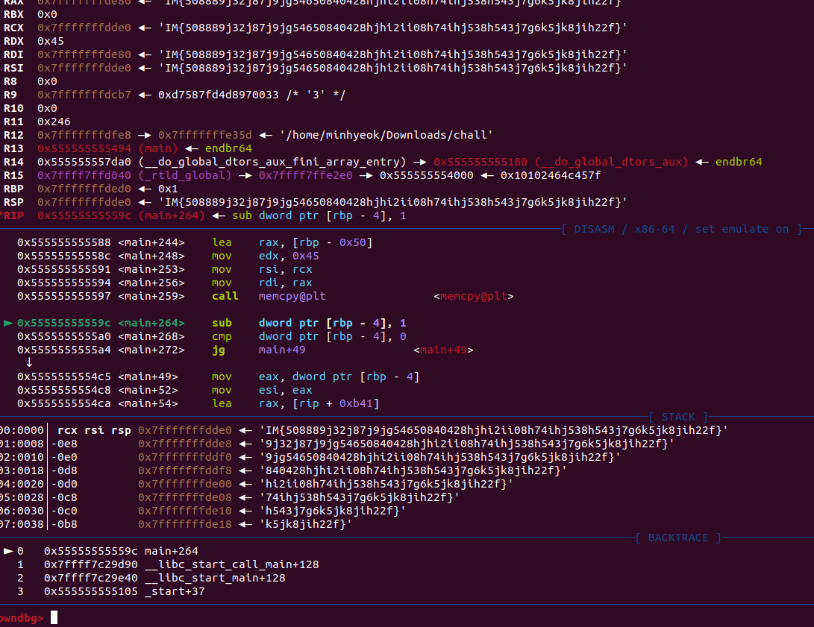

# wargame : Small Counter

- 문제는 프로그램 내에 있는 flag_gen()함수를 찾아 호출하는 것이다.
- 많이 쓰는 명령어 : b *main, r, ni, si, c, finish, set 등..
- 먼저 main에서 시작해 ni로 실행하며 살펴보았는데 flag_gen()은 없고 해봤다 memcpy@plt 밖에 안보인다. 아마 중간중간 분기하며 점프하는 곳을 잘 피해가며 찾아야 할거 같다.
    
    
    
- 최대한 cmp, jne, jg 이런곳을 주소값을 패치하면서 이리저리 피해다녀 보았다.
    
    일단 [rbp-4]의 내용을 set 으로 바꾸면서 진행했는데 더 좋은 패치방법이나 접근법이 있을것 같긴하다.
    
    
    
- 암튼 요리조리 피하다 보니 찾았다. 실행해보니까 RDX랑 RSI에 플래그가 떴다!
    
    