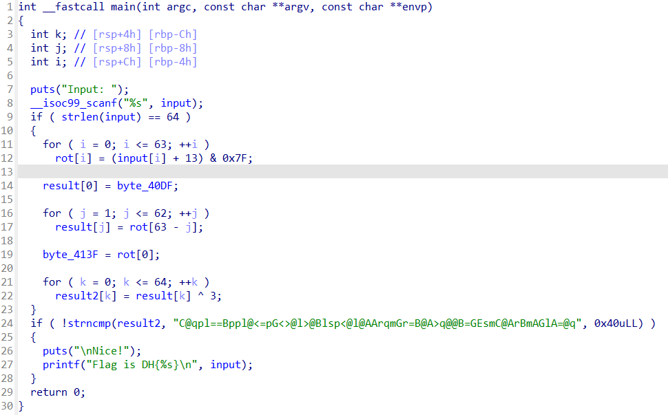

# wargame : r-xor-t

- 먼저 늘 하던대로 main으로가서 코드를 보았다
    
    
    
    마지막에 !strncmp()하고 Flag를 출력하는거 보니 strncmp안에있는 문자열과 result2가 같으면 0을 리턴하므로 !를 붙여준걸보니 위에 여러 연산들을 거쳐 최종적으로 저 문자열이 나오면 되는것 같다. 그러므로 역으로 저문자열로 역연산을 해야겠다.
    
    일단먼저 9행에서 input은 64개여야 하고
    
    11,12행에선 input문자 하나당 13을 더해준값에 (0111 1111) and연산을 해준다
    
    16,17행은 문자열을 reverse해주는것같고
    
    21,22행은 ^연산이니 3과 xor연산을 해주어 최종적인 result2를 얻어낸다.
    
     
    
    
    
    먼저 result2를 그대로 받아서 역으로 계산한다.
    
    6,7행은 각자리를 3으로 xor연산 해주었고
    
    10,11,12 행은 list로 바꿔서 reverse()를 사용해서 거꾸로 돌려주었다.
    
    15,16행은 각자리에 13씩만 빼주었는데 (0111 1111) and연산은 사실 맨 앞자리만 0으로 만들고 나머지는 그대로인 연산인데 혹시 큰 의미 없지 않을까해서 무시하고 13만 빼보았는데 문제가 풀렸다.
    
    decompile된 내용을 하나도 빠뜨리지않고 이해해서 적용하진 못했지만 큰 흐름을 따라가다보니 풀렸다.
    
    