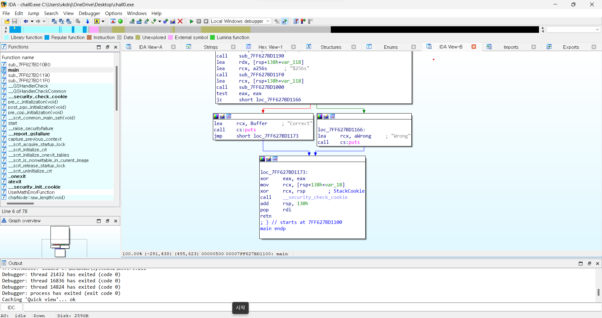

# wargame : rev-basic-0

- 먼저 파일을 다운받아서 IDA로 실행한다.
- main함수 쪽의 String들을 보면 Input을 받아서 원래 답안과 비교해 Correct or Wrong을 출력하는 프로그램임을 유추할 수 있는다. Correct를 출력하게 만드는 답안이 Flag이다.

- 사실 이 문제는 String중에 답이 써있다…. 제출하면 끝