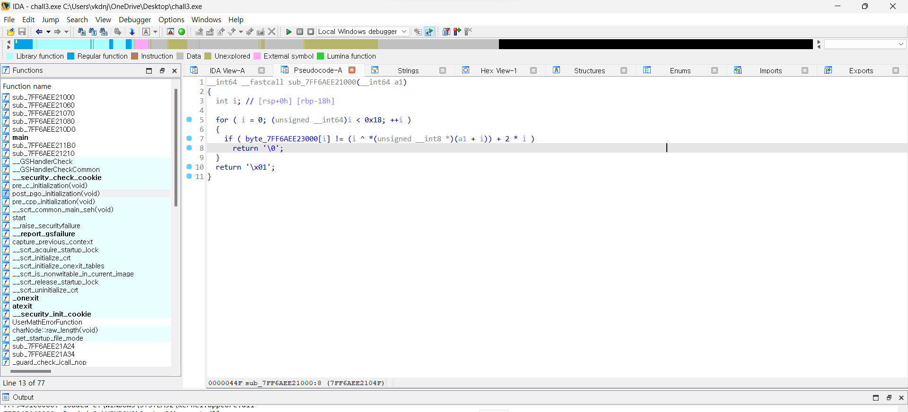

# wargame : rev-basic-3

- 문제를 다운받아 IDA로 실행시킨 후 살펴보았다.
    
    
    

- 이런 화면을 볼 수 있는데, 입력받은 값을 임의의 연산 후 주소에 있는 값과 비교하는 것 같다. i가 0부터 i<0x18 까지 진행된다. i^는 XOR연산이고, a1은 뭔지 모르겠어서 찾아봤다.

- (input[i]^i)+(i*2)=str[i] 정리하면 이런 뜻이 된다. a1은 내 입력값의 시작 주소였다. 리버싱중 이러한 연산과정을 만나게 되면 역연산이라는 과정을 거쳐야 한다고 한다. 양변을 정리해서 원래의 input항만 남기는 것이다.

- 먼저 양변에 -(i*2)를 하게되면 input[i]^i = str[i]-(i*2) 가 된다. ^i는 xor연산이니 같은값으로 한번더 해주면 원래값이된다. 즉 두개면 없어진다. 양변에 ^i를 하면 input[i] = (str[i]-(i*2))^i 가 최종적으로 역연산 식으로 나온다.

- 이를 이용해 파이썬으로 코딩을 하게되면
    
    ---
    
    str='49','60','67','74','63','67','42','66','80','78','69','69','7B','99','6D','88','68','94','9F','8D','4D','A5','9D','45'
    res=''
    
    for i in range(24):
       res+=chr((int(str[i],16)-(i*2))^i)
    
    print(res)
    
    ---
    
    가 되고, 실행하여 flag를 얻어낼 수 있다.