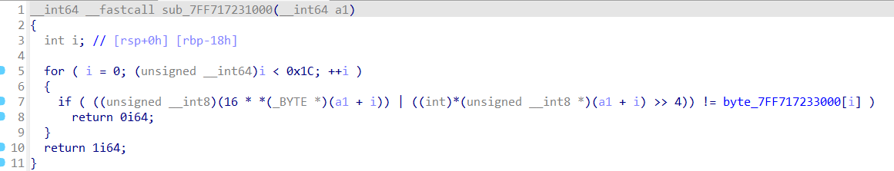

# wargame : rev-basic-4

- 먼저 문제를 받은 후 늘하던대로 correct 조건 함수를 살펴보았다.
    
    
    
    입력받은 값의 주소를 받아 계산하여 7FF~3000번지의 값들과 비교 하는 문제였다.
    
    역연산을 하려고 봤는데 OR연산(|)은 역연산이 안된다고 했다. 그래서 어떤 특징이 있을까 하고 살펴봤는데 or연산을 기존값*16 즉, <<4한 값과, >>4한 값에대해 하는 것이었다.
    
    예를들어 0x46 이라는 값에 적용 한다고 하면 0100 0110 인 값을 왼쪽으로 4비트 밀면 0110 0000 이되고, 오른쪽으로 4비트 밀면 0000 0100 이 될 것이다. 이 둘을 or 연산을 하면 결국 0x64라는 십의자리와 일의자리의 값이 바뀐 값으로 변하게 된다.
    
- 이 특징을 찾아내어 역연산에 적용해 보았다.
    
    
    
    7FF~3000번지에 들어가 있는 값들이다.  저 값들은 입력값에 대해 앞선 계산 이후의 만족해야 할 값들이기 때문에 역으로 생각해보면 0x24는 0x42가 되었을 것이고 뒤에 것들도 똑같이 자리가 서로 바뀌었을 것이다. 그래서 먼저 
    
    int(str[i],16) : str[i]의 값을 16진수의 정수값으로 전환 
    
    한뒤에 <<4( == *16)를 해준다. 값이 많이 커질텐데 우리는 1byte내에서 계산하기 때문에 넘어가는 수는 사라진다 해서 %256을 하여 몫이되는 값들은 버려준다.