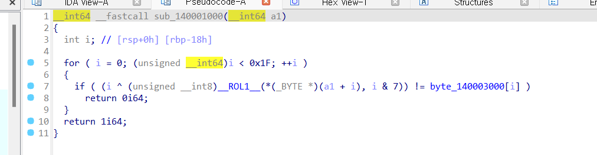

# dreamhack : rev-basic-7



- input[i]^i는 알겠는데 콤마하고 i&7 가도저히 뭔지 모르겠어서 어셈블리 코드를 봤다.


- [rsp+18h+var_18] = i
eax = i&7
rcx= i(64bit)
    
    대충 이런식으로 가다가 rol al, cl이라는 명령어가 나온다. 처음보는 명령어라 구글링 해보니 al을 cl만큼 rotate left 하는 명령어였다. al,cl은 각각 1byte값이므로 8bit연산을 의미한다. 
    
    그럼결국 ROL(input[i], i&7)^i = 140003000[i] 가된다.
    
    역연산을 해보면 
    
    ROL(input[i], i&7) = 140003000[i]^i
    
    input[i] = ROR(140003000[i]^i, i&7) 이된다…!
    
    ```python
    str=[0x52, 0xDF, 0xB3, 0x60, 0xF1, 0x8B, 0x1C, 0xB5, 0x57, 0xD1, 
      0x9F, 0x38, 0x4B, 0x29, 0xD9, 0x26, 0x7F, 0xC9, 0xA3, 0xE9, 
      0x53, 0x18, 0x4F, 0xB8, 0x6A, 0xCB, 0x87, 0x58, 0x5B, 0x39, 
      0x1E, 0x00]
    
    res=[]
    
    def ror(val, cnt):
      if(cnt==0) :
        return val
      
      for i in range(1,cnt+1) :
        if (val%2==0):
          val=val>>1
        else :
          val=val>>1
          val+=128
      return val
    
    for i in range(31):
      res.append(ror(str[i]^i, i&7))
    
    for i in range(31):
      print(chr(res[i]), end="")
    
    ```