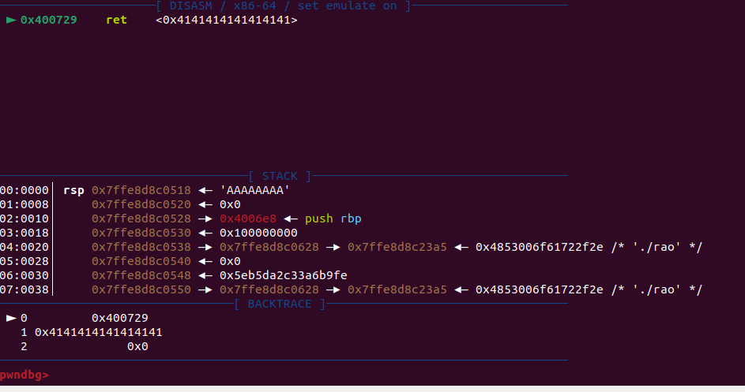

# wargame : Return Address Overwrite

- #include <stdio.h>
#include <unistd.h>
void init() {
setvbuf(stdin, 0, 2, 0);
setvbuf(stdout, 0, 2, 0);
}
void get_shell() {
char *cmd = "/bin/sh";
char *args[] = {cmd, NULL};
execve(cmd, args, NULL);
}
int main() {
char buf[0x28];        /0x28보다 갈게해서 main함수의 리턴주소를 덮어야
init();
printf("Input: ");
scanf("%s", buf);
return 0;
}
    - 주어진 프로그램의 취약점은 scanf(”%s”, buf)에 있다. 왜냐하면 %s는 문자열을 입력받는데 입력의 길이를 제한하지않아서 널값이 올때까지 문자열을 받는다. 이 값의 크기가 버퍼의 크기보다 커지면 오버플로우가 발생해 문제가 생긴다. %[n]s로 문제를 예방할수 있다.
    - C/C++에서 버퍼를 다루면서 길이를 입력하지 않는 함수들 대부분은 위험하다고 생각해야 한다. 예를들면 strcpy, strcat, sprintf 등이 있다. 버퍼의 크기를 같이 입력하는 strncpy, strncat, snprintf, fgets, memcpy 등을 사용하는 것이 바람직하다.
    - 이 예제에선 버퍼의 크기가 0x28이므로 이보다 입력을 길게주어 버퍼 오버플로우를 발생시켜 main함수의 리턴주소를 덮을 수 있다.
    - OOB(Index Out-of-Bound) : 문자열 함수는 널바이트를 찾을때까지 배열을 참조하므로 코드를 작성할때 정의한 배열의 크기를 넘어서도 계속해서 인덱스를 증가시킨다. 이러한 현상을 OOB라고 하고 이 취약점을 OOB취약점이라고 한다.
    - 취약점을 확인하기 위해 트리거(취약점을 발현시킨다는 의미)를 이용. 버퍼크기보다 크게 값을 입력해 프로그램이 비정상적으로 종료된다. 이때, core파일을 생성하는데 이는 프로그램이 비정상 종료 됐을때, 디버깅을 돕기위해 운영체제가 생성해 주는 것이다.
    - 코어파일을 분석해보니 프로그램이 main함수에서 반환하려고 하는데 스택 제일위값이 우리가 입력한 부분의 끝부분인 AAAAAAA가 있어서 이는 실행하지못하기 때문에 세그먼테이션 폴트가 발생한 것이다. 이를 실행가능한 메모리의 주소로 채워넣어 주면 될 것이다.
        
        
        
    
    - 먼저 스택버퍼에 오버플로우를 발생시켜 반환주소를 덮어쓰려면, 해당 버퍼가 스택 프레임의 어디에 있는지 알아야 한다.
        
        
        
    - 오버플로우를 발생시킬 버퍼는 rbp-0x30에 위치한다. 스택프레임을 생각해보면 rbp에 스택프레임포인터(SFP)가 저장되고, rbp+0x8에는 반환주소가 저장된다. 입력할 버퍼와 반환될 주소 사이에는 0x38만큼의 거리가 있으므로, 그만큼을 쓰레기값으로 채우고, 예제내에 존재하는 get_shell()함수의 주소로 반환시켜주면 셸을 얻을 수 있을 것이다.
        
        
        
    - get_shell()의 주소는 0x4006aa이다. 이를 반환주소에 입력되게끔 페이로드를 작성하면 된다.
        
        
        
    
    - 하나 고려해야할 부분이 엔디안 방식이다. 잇스플로잇할 대상의 엔디안을 항상 고려해야한다. 여기서는 리틀 엔디안을 사용한다. 그러므로 0x4006aa는 “\xaa\x06\x40\x00\x00\x00\x00\x00”으로 전달어야 한다.
    
- 여기부턴 pwntool을 사용하여 익스플로잇을 진행한다.
- pwntool은 익스플로잇 코드를 일일이 프로그래밍 코드로 짜다보면 비효율적이기 때문에 시스템해커들이 자주 사용하는 기능들을 효율적으로 구현해 놓은 파이썬 모듈이다. 이로 인해 익스플로잇이 간단하고 쉬워졌다. 이제 익스플로잇 대부분이 pwntools를 이용하여 제작되므로 알아놔야한다.
- pwntools API
    - process & remote
        - process : 로컬 바이너리 대상 (p = process(’./text’)), 보통 익스플로잇 테스트,디버깅용
        - remote : 원격 서버 대상 (p = remote(’example.com’ , 31337)), 대상서버 실제 공격용
    - send
        - from pwn import *
        p = process('./test')
            
            p.send(b'A')  # ./test에 b'A'를 입력
            p.sendline(b'A') # ./test에 b'A' + b'\n'을 입력
            p.sendafter(b'hello', b'A')  # ./test가 b'hello'를 출력하면, b'A'를 입력
            p.sendlineafter(b'hello', b'A')  # ./test가 b'hello'를 출력하면, b'A' + b'\n'을 입력
            
    - interactive : 셸을 획득했거나, 익스플로잇의 특정 상황에 직접 입력을 주면서 출력을 확인하고 싶을때. (p.interactive())
    
    - packing & unpacking: 정수를 바이트 배열로, 또는 바이트 배열을 정수로 변환
    - context.arch: 익스플로잇 대상의 아키텍처
    - context.log_level: 익스플로잇 과정에서 출력할 정보의 중요도
    - ELF: ELF헤더의 여러 중요 정보 수집
    - shellcraft: 다양한 셸 코드를 제공
    - asm: 어셈블리 코드를 기계어로 어셈블

- 먼저 익스플로잇용 프로그램이다.
    
    
    
    원격 서버로 접속
    
    p64()를 이용해 리틀엔디안으로 바꾼다.
    
    p.send로 입력을주고 셸 함수로 리턴하여
    
    p.interactive()로 셸을 사용할 수 있다.
    
    