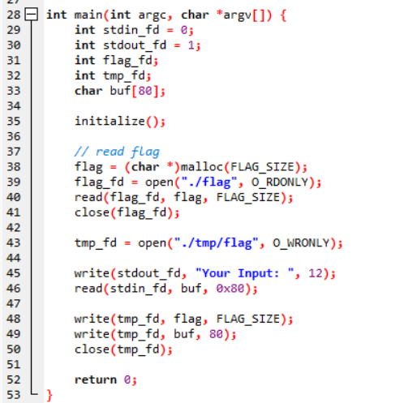

# wargame : awsome_basic

- 이번에도 BOF를 이용한 취약점이다.
    
    buf크기는 80인데 read()함수에선 0x80만큼 읽어들이고있다. 여기서bof가 발생한다.
    
    
    
    
    
    read()함수 실행시 buf가 들어가는데 [rbp-0x60]에서 불러들이고 있다. buf의 위치는 rbp-0x60이다.
    
- 먼저 ./flag 파일에서 flag를 읽어와서 flag라는 변수에 저장시키고 파일을 닫는다.
    
    이후에 .tmp/flag 에다가 내가 입력하는 값과 아까 읽어온 flag변수의 값을 써넣는다.
    
    write()의 첫번째 인자인 fd의값을 tmp_fd가아닌 표준출력을뜻하는 stdout_fd==1, 즉 1을 인자로 넘기면 .tmp/flag에 쓰여야할 값이 화면에 출력이 되게 된다.
    
- tmp_fd로 넘어가는 값의 위치가 [rbp-0x10]인걸 볼 수 있다. 0x50인 buf와 딱 붙어있다.
    
    
    
- 그래서 exploit 코드는 이렇게 된다.
    
    