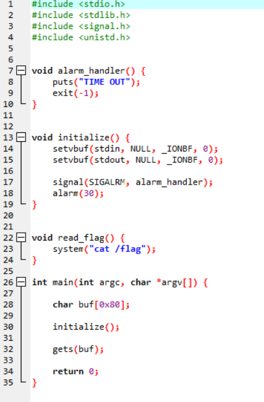

# wargame : basic_exploitation_001

- 오버플로우를 이용해 reutrn address에 실행시키기 원하는함수의 주소를 써넣는 문제이다.
    
    
    
- main에는 read_flag()를 실행시키지 않는다. 얘 실행시키기만 하면 flag를 얻을 수 있다.
- 스택 프레임을 구성할때, buf크기 + SFP(Stack Frame Pointer)→return address 가 온다.
    
    
    
    buf크기가 0x80, sfp는 0x4인 4바이트, 이후에 리턴 어드레스가 오기때문에
    
    총 128+4 바이트를 쓰레기값으로 채워주고 read_flag()의 주소를 넣어주면 된다.
    

 

- 함수의 위치를 찾기위해 info function 명령어로 함수들을 찾는다.
    
    
    
    0x080485b9 임을 알수있다.
    

- 이 모든 내용들을 이용해 pwntools로 exploit 코드를 짜면
    
    
    
    유의할 점은 리턴주소값을 넣을때, 리틀엔디안을 유의해야하기때문에 p64()로 돌려서 넣는다.