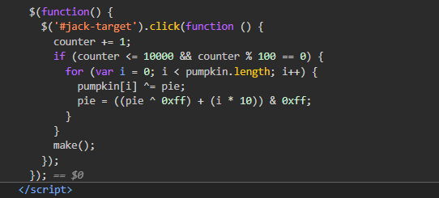

# wargame : Carve Party

- 화면에 호박을 10000번클릭해서 플래그를 얻어내는 형식이다.
    
    만번을 다 클릭할 순 있겠지만 그걸 원하는건 아니라 코드를 좀 봐야한다.
    
    중요한 부분은 이부분인거 같은데 클릭한번 할때마다 counter가 1올라가고
    
    counter값이 0부터 시작해서 100의 배수가 될때마다 배열에 값이 저장되는것 같다.
    
    처음엔 한번 클릭할때마다 1000씩, 500씩, 100씩 올라가게끔 해봤는데 이방법은 아니었다.
    
    1씩 올라가게하는걸로 접근해야 올바른값이 저장되는것 같았다 그래서 콘솔창을 이용해서 이함수를 좀 손보았다. 10000번 반복해서 counter를 올리는것으로…..
    
    