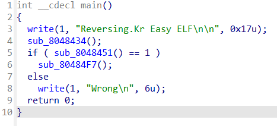

# wargame : Easy_ELF

- 문제는 문자열을 입력받아 오른쪽 함수에서 1을 리턴하면 correct이고 아니면 wrong이 되는 함수이다. 즉, 오른쪽을 잘 해석하면 될것이다.

- 보면 byte_804A021~~ 이런식으로 비슷한 주소들이 이리저리 섞여 나열되있다. 만약 중간에 하나라도 거스르면 return 0으로 함수가 끝나게 되는 구조여서 모두 만족하여 마지막 return byte_804A023 == -35 에서 참을 만족하면 되는 문자열을 찾아야 한다.
- 특정 문자열이 입력되어 byte_804A020부터 25까지의 주소를 채우게 될것이다. 순서를 잘맞춰 모두 만족하는 문자열을 찾아야한다.
    
    
    
    xor의 역연산은 같은수를 한번더 xor해주면 된다. -35는 1byte 16진수로 표현하면 DD가 된다.(2의보수) 해서 플래그를 얻어낼 수 있었다.