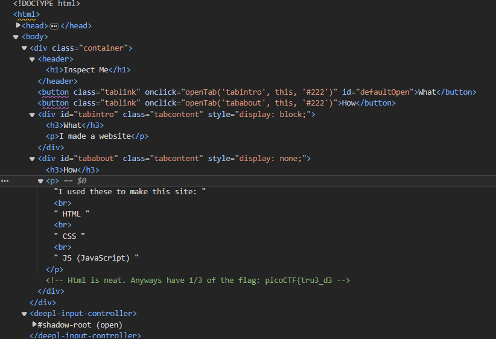

# wargame : Insp3ct0r

- 문제 페이지를 들어가 개발자도구를 이용해 조금 살펴보면
    
    
    
- 이런식으로 flag가 세등분이되어 코드들 곳곳에 적혀있음을 추측할 수 있다.
    
    아마 html, js, css 각각 써있을 것 같다.
    
    직접 찾아봐도 좋지만 Ctrl+Shift+F 로 전체 검색기능을 사용해서 한번에 찾을 수 있다.