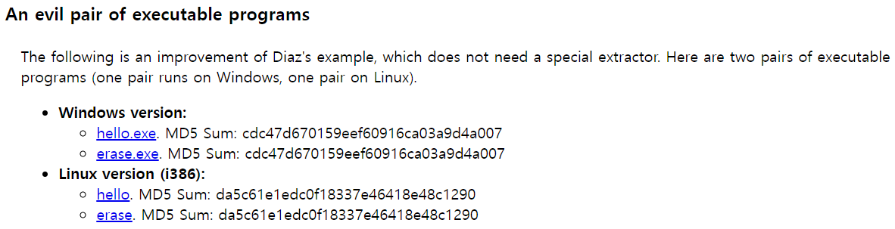

# wargame : It is my Birthday

- 먼저 문제를 대충 읽어보고 게임에 들어갔는데 pdf파일을 업로드 하라고 하길래 파일 업로드 취약점 관련 문제라고 생각했다. 그래서 드림핵 파일업로드 취약점 강의를 보면서 생각해봤는데 도저히 모르겠어서 인터넷에서 힌트를 좀 보니 md5 hash collusion이 포인트인걸 알았다.
- 문제에서 언급돼었던 것처럼 md5 hash는 같지만 분명 다른 초대장이라고 했었다. 이미 이 해시함수는 2005년에 파훼되었다고 한다.
    
    
    
    아무튼 저 evil pair들을 다운받아 pdf로 확장자만 바꿔 업로드 하니 문제가 풀렸다.