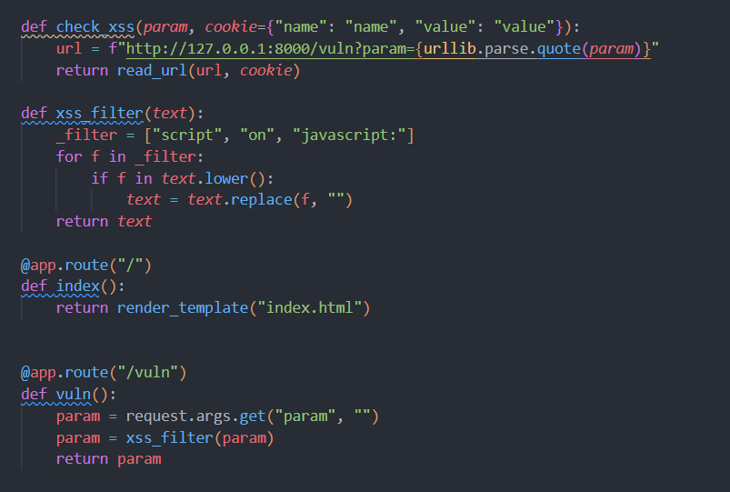
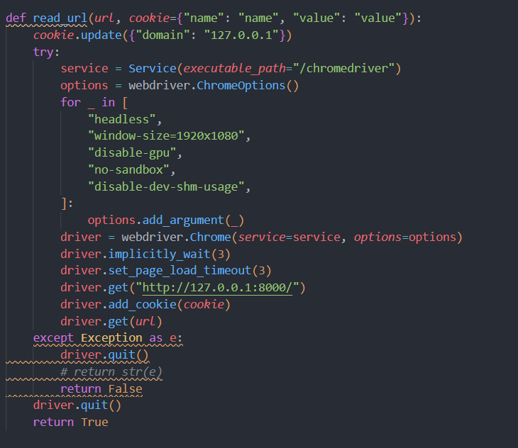
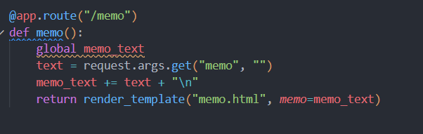
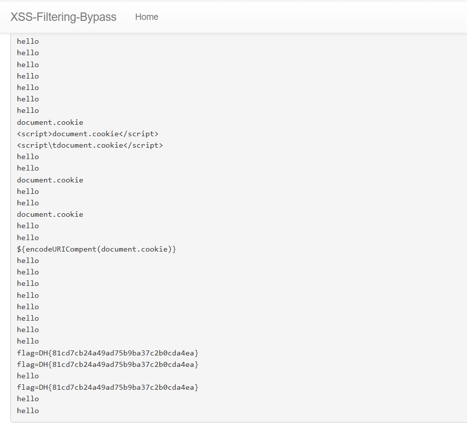

# XSS Filtering Bypass

- 먼저 xss_filter부분을 보면 script, on, javascript부분을 단순히 없애기만 한다.
- 이렇게 되면 해당 태그사이에 태그를 넣어 우회가 가능하다.
- <scriscriptpt></scriscriptpt> 이런식으로 진행하면된다.

- read_url을 보면 localhost에다가 cookie를 더하고, 최종적으로 url로 접속하는 것 같다.
- 피해자의 역할을 하는 bot일 것이다. admin의 역할을 갖는 bot이 저 flag값인 cookie를 내가 볼 수 있도록 어딘가로 보내거나, 적거나 하면 될것같다.

- 이제 그 부분이 여기인것인데, /memo?memo="" 으로 url에 넘긴 값을 memo page에 적게된다.
- 여기에 bot의 cookie값(flag)을 보내면 될것이다.

- exploit
  - <scriscriptpt></scriscriptpt> 사이에 저 memo값에 cookie를 담는 get요쳥을 넣으면 될것같다.
  - js에서 http요청은 fetch()를 통해서 보내고, get은 간단하다.
  - <scriscriptpt> fetch("/memo?memo="+document.cookie) </scriscriptpt> 로 적어주면

- 성공!!
	