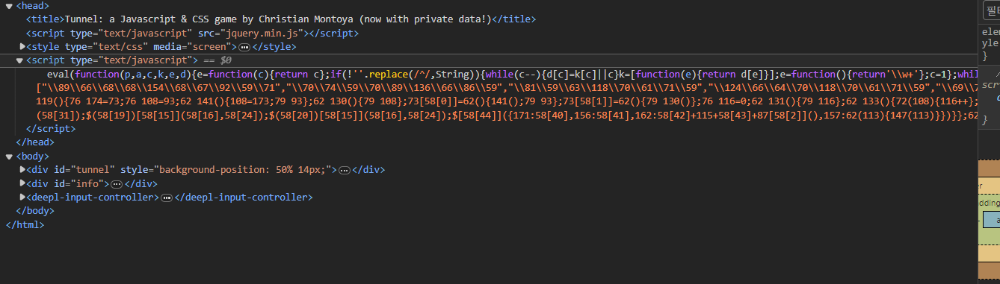

# wargame : fly me to the moon

- 문제를 보니 비행기 게임을 해서 31337점을 넘겨야 flag를 알 수 있다고 한다.
- 아마 저 score값을 31337로 조작하면 될 것 같다.
- 소스를 보는데 script가 이상하게 써있는걸 볼 수 있다.
    
    
    
    이건 난독화 기법인데 앞에 eval(function(p,a,c,k,e,d) ~~ 가 난독화 되어있다는 힌트라고 한다.
    
    이 내용을 복호화 하게 되면 긴 코드가 나오게 된다.
    
     
    
    ```
    function _0x8618x4() {
        _0x8618x3 = false;
        return true
    };
    
    function _0x8618x5() {
        return _0x8618x3
    };
    this['killPlayer'] = function() {
        _0x8618x4();
        return true
    };
    this['checkLife'] = function() {
        return _0x8618x5()
    };
    var _0x8618x6 = 0;
    
    function _0x8618x7() {
        return _0x8618x6
    };
    
    function _0x8618x8() {
        if (_0x8618x3) {
            _0x8618x6++
        };
        return true
    };
    this['getScore'] = function() {
        return _0x8618x7()
    };
    this['BincScore'] = function() {
        _0x8618x8();
        return true
    };
    var _0x8618x9 = 320;
    
    function _0x8618xa() {
        _0x8618x9 -= 20;
        return true
    };
    
    function _0x8618xb() {
        return _0x8618x9
    };
    this['shrinkTunnel'] = function() {
        _0x8618xa();
        return true
    };
    this['widthTunnel'] = function() {
        return _0x8618xb()
    }
    
    ```
    
    앞뒤로 길게 있지만 중요한건 이 코드이다.
    
    중간에 getscore라는 함수가 보이고 이는 0x8618x7을 리턴한다. 그 이름의 함수로 또 가보면 0x8618x6을 리턴하고 또 이이름으로 가보면 var로 선언되어 0으로 초기화 되는 모습이 보인다.
    
    이걸 31337로 바꾸어보면 flag를 얻을 수 있다.(콘솔로 조작!!)