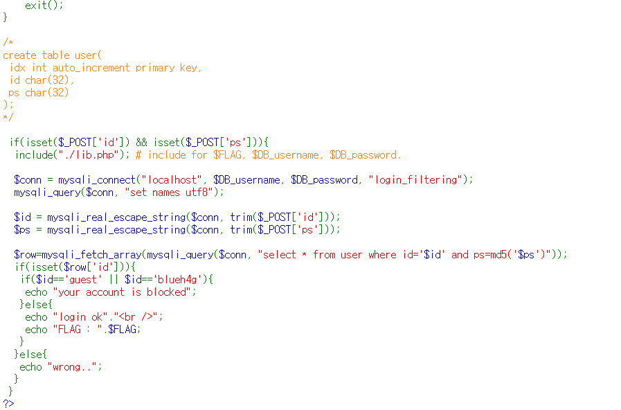

# wargame : [wargame.kr] login filtering

- 문제의 코드를 봤다. 아이디와 패스워드를 입력하는데 id가 guest 거나 blueh4g 이면 필터링 당하는 식이다.
    
    
    
- 마지막줄에 블록된 아이디/패스워드가 쓰여있었다.
    
    
    
- sql문이 보여서 sql injection인가 하고 아주 기초적인것만 시도해봤는데 안되길래 왜안될까 하고 보니 제일 첫 if문에서 DB에 동일한 id값이 존재하는지 먼저 보고 없으면 바로 wrong으로 빠지는 식이었다. 그래서 주어진 아이디들을 사용해야하는구나 하고 생각하고 대문자로 적어보았다…