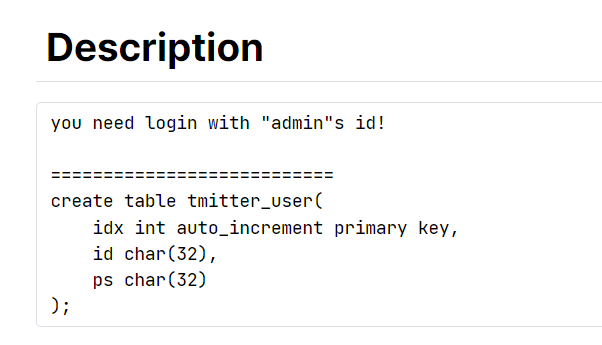

# wargame : [wargame.kr] tmitter

- 먼저 문제 첫 화면엔 로그인과 회원가입창이 나뉘어 있다.
- 주어진 로그인 정보가 없어 회원가입으로 들어가 개발자 도구를 살펴보면 ‘hint : you need join with admin’ 라고 힌트가 주어져 있다. admin으로 회원가입을해라? admin을 활용해 회원가입을 하라는 뜻인 것 같다. 처음 문제 자체도 admin으로 로그인을 하라고 나와있었으니 admin으로 회원가입을해서 admin으로 로그인을 하면 문제가 풀리는 방식인가보다.
- 처음엔 admin으로 회원가입을 할 방법을 모르겠어서 바로 login창으로 가서 기초적인 sql injection을 몇개 해보았으나 안돼어서 다시 회원가입창으로 돌아왔다.
- 여기 보면 id와 ps의 자료형이 char(32)인걸 볼 수 있다. 보통은 가변적인 길이를 주기 위해 varchar()를 많이 쓰는걸 봐왔다. 만약 32byte를 넘어가면 overflow가 될텐데 어떻게 될까
    
    
    
- 코드에 maxlength가 32로 설정되어 있어 넘어가질 못한다. 그냥 더블클릭해서 40으로 늘려버린다. 그리고 admin이후 공백을채워 32를 넘어가게 한다음 아무문자나 하나 쳐서 회원가입을 해본다.
    
    
    
- 로그인 창으로 와서 그냥 admin으로 내가 가입했던대로 했더니 성공했다. 아마 내가 회원가입했을땐 기존 admin과 다르긴 하니까 가입이 되었는데 저장될땐 32byte까지밖에 안돼서 같은 admin으로 저장이 된 것 같다.