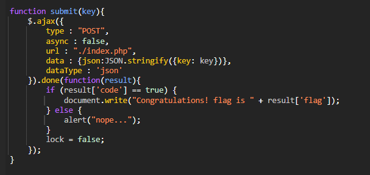

# wargame : [wargame.kr] type confusion

- php에서의 loose comparison을 이용한 type confusion 문제이다.

```jsx
if (isset($_POST['json'])) {               //json형태의 데이터를 받는다면
     usleep(500000);                       //500000마이크로초
     require("./lib.php"); // include for FLAG.

     $json = json_decode($_POST['json']);   //받았던json값을 json변수에 저장 
     $key = gen_key();                      //해시값key생성함수의 리턴값을 key변수에 저장
     if ($json->key == $key) {              //만약 json변수의 key필드의 값이 key변수와 같다면(여기서 loose comparison 발생)
          $ret = ["code" => true, "flag" => $FLAG];  //json형태인 ret변수에 [code:ture, flag:DH{ }] 로 저장
     } else {
          $ret = ["code" => false];
     }
     die(json_encode($ret));               //ret값 출력후 연결끊음
}
```

- util.js의 submit함수 내용이다.
    
    JSON.stringify()는 Javascript내용을 JSON문자열로 반환한다
    
    그렇게 되면 {key : key} 객체는 json문자열인 {”key” : “key”}로 바뀐다.
    
    {a : b} ↔ {”a” : “b”} 이런 형태를 갖는건데, json값을 줄때, 문자열인 “bool”값을 넘기면 바뀐후에는 문자열이 아닌 boolean값인 bool 로 인식될 것이다.
    
    json_decode() 를 통해 {key : true}로 바뀌도록 {”key” : “ture”}주는 것이다. 그럼 {key : true}로 바뀔 것이고, 이 true와 loose comparison이 합쳐져 결과를 참으로 만들 수 있
    다. 
    
    
    
- js파일 수정할때, break point 잡아놓고, 새로고침 후에 수정하고 실행해야 적용된다.